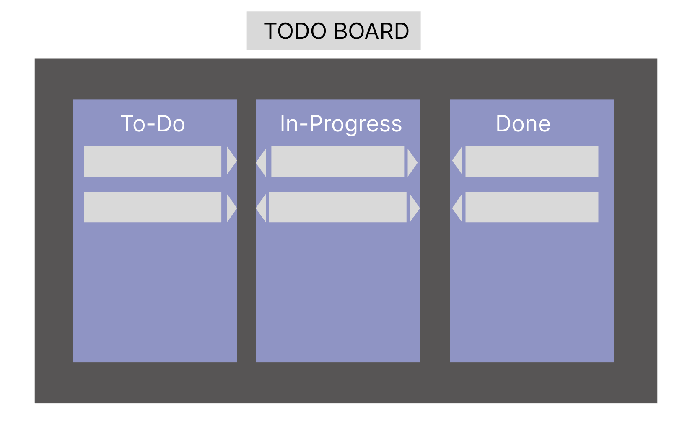
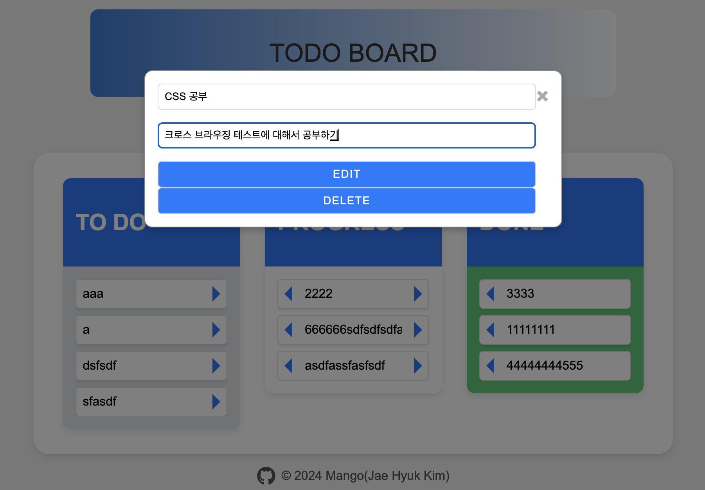

# TODO앱 만들기(HTML,CSS,JS)

## 기능 명세

- 할 일 목록을 보여준다.
    - 수정 시간순 정렬
- 할일을 생성한다.
- 할일을 수정한다.
- 할일을 삭제한다.
- 할일의 상태를 변경한다.(TODO | PROGRESS | DONE)

## UI


## 데이터 정의

```json
{
	"todo": [
		{
			"id": "task-${UUID}",
			"title": "string"
			"description": "string",
			"status": "string",
			"createdAt": "datetime",
			"modifiedAt": "datetime"
		},
		{
			"id": "task-${UUID}",
			"title": "string"
			"description": "string",
			"status": "string",
			"createdAt": "datetime",
			"modifiedAt": "datetime"
		}
	],
	"progress": [
		{
			"id": "task-${UUID}",
			"title": "string"
			"description": "string",
			"status": "string",
			"createdAt": "datetime",
			"modifiedAt": "datetime"
		}
	],
	"done": [
		{
			"id": "task-${UUID}",
			"title": "string"
			"description": "string",
			"status": "string",
			"createdAt": "datetime",
			"modifiedAt": "datetime"
		}
	]
}

```

## 페이지 화면


